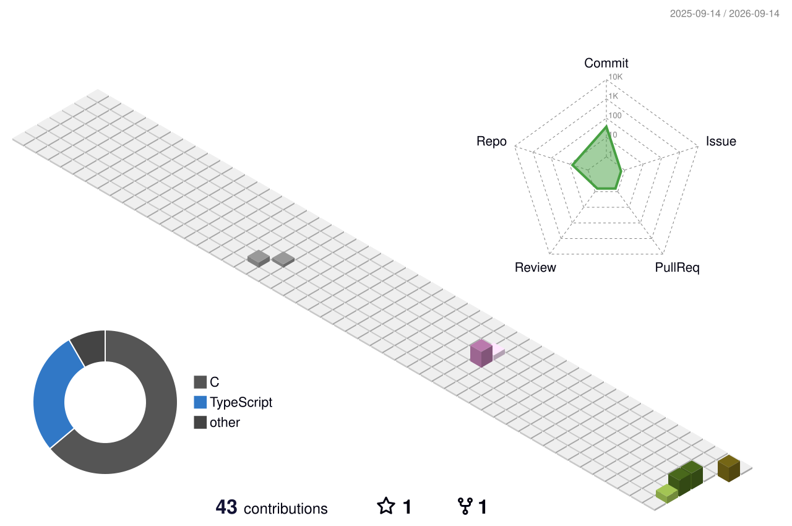

##  WindDevil

> [!NOTE]
> Welcome to my repositories. I hope you can enjoy everything here.

Hi , I'm **WindDevil**, a systems engineer at [Cambricon](https://github.com/Cambricon) (Beijing). I work mostly in **C, C++ and Rust**, across Linux user space and the kernel: system calls, POSIX APIs, device drivers, and the toolchains that glue them together.

> [!IMPORTANT]
> **I'm looking for PhD opportunities.**
> **Part-time / in-service PhD positions in Beijing** · **Full-time PhD positions anywhere.**
> Research directions: **AI Infra & Operating Systems**, and **Embodied Intelligence**.
> Research collaborations and part-time roles in these areas are welcome as well.
> Feel free to reach me at [1160712160@qq.com](mailto:1160712160@qq.com).

I like turning hard-won debugging knowledge into reproducible practice material, and that is what most of my repositories exist for:

- **[clings](https://github.com/WindDevil/clings)** — 185 hands-on C exercises across 20 topics, from `Hello, C!` to pointers, memory, the preprocessor, undefined behaviour and C11/C17 features.
- **[lspling](https://github.com/WindDevil/lspling)** — 140 Linux/POSIX system programming exercises, arranged chapter by chapter after Robert Love's *Linux System Programming* (2nd edition).

Both are spec-driven: a single specification generates the initial exercise, the reference solution and the reset template, a dependency-free Python CLI drives the daily workflow, and CI proves that every exercise starts unsolved while every answer passes.

Beyond that I write Rust drivers — mainly for the Intel igb network controller, with [ArceOS](https://github.com/WindDevil/arceos_igb_driver) as the unikernel playground — and tinker with embedded boards (ESP32 + RT-Thread, STM32). I keep notes at [my blog](https://www.cnblogs.com/chenhan-winddevil) (in Chinese).

Before that I received my Master's degree from UESTC (University of Electronic Science and Technology of China) and my Bachelor's degree from GUET (Guilin University of Electronic Technology).

**Contact:** [1160712160@qq.com](mailto:1160712160@qq.com)

Counting of visitors to this page in this section started on 2026-09-14:

 

<!-- github-readme-stats cards, enable them whenever you want a numbers-first header:

  

-->

<!-- Currently Working on: -->
<!-- 
<image src="imgs/linux.png"/>
 -->
